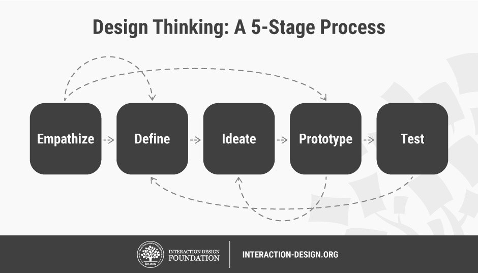

# Week 03 Journal

We define **Smart (_adj._)** as _having or showing a quick-witted intelligence_ whereas a smart object can be defines as an object or device programmed so as to be capable of some independent action. Also, smart object can also be defined as an object which knows its surrounding and is capable of performing actions intelligently and independently. If we look all around us, we will spot smart objects all around be it your smartphone, smart lights, smart cameras, smart voice assistants, smart furniture and many more. What do you think was the first smart object? In the early 1990s, Mark Weiser, from whom the term ubiquitous computing originated, referred to a vision _"When almost every object either contains a computer or can have a tab attached to it, obtaining information will be trivial”_, which is essentially how smart objects or smart computing was envisioned to be achieved. In 2010, smart objects were linked to Internet of Things (IoT) which are considered smart objects in today’s world.

Design Thinking is an iterative process in which we seek to understand the user, challenge assumptions and redefine problems in an attempt to identify alternative strategies and solutions that might not be instantly apparent with our initial level of understanding. Design Thinking involves sketching, prototyping, testing and reiterating until an idea or concept satisfies needs of user it is being designed for. Design Thinking is usually a flow and iteration to empathize, define, ideate, prototype and test.

In Physical Computing as well we can apply these concept to design our projects based upon the notion of “Smart”.
1. **Empathize** - The very first stage in design thinking involves researching user’s needs. Generally, in design thinking we make assumptions while designing a product but empathy  allows us to set aside these  assumptions and peek into user’s needs and also allows us to look through their own perspective
2. **Define** - In this stage we state our user’s needs. We analyze user’s needs and synthesize that data to define the problem statement we would be working for.
3. **Ideate** - The third stage challenges assumptions and make designers think of potential ideas which lead to finding the solution to the problem statement we defined in stage two.
4. **Prototype** - In fourth stage we start to give form to the ideas we thought about in third stage. We work towards solutions to solve problems we defined. Prototyping is building scaled down versions of products we intend to build. Prototypes are also low fidelity minimum viable products that test out the functionality of solution quickly.
5. **Test** - The final but a very important stage in design thinking process. We start evaluating the solutions and organize it in a particular order of preference. So we can pick the most viable solution that solves the problem and start to further build it into high fidelity prototypes and further complete solutions that solves the problem statement generated during the process.

We we look at the block diagram above, we see a bunch of arrows in reverse direction, these arrows state if we fail at any stage then were to start again to get a solution that solves user’s problems. This is a process were reiterations are welcomed and are carried out until needs of the user are satisfied.