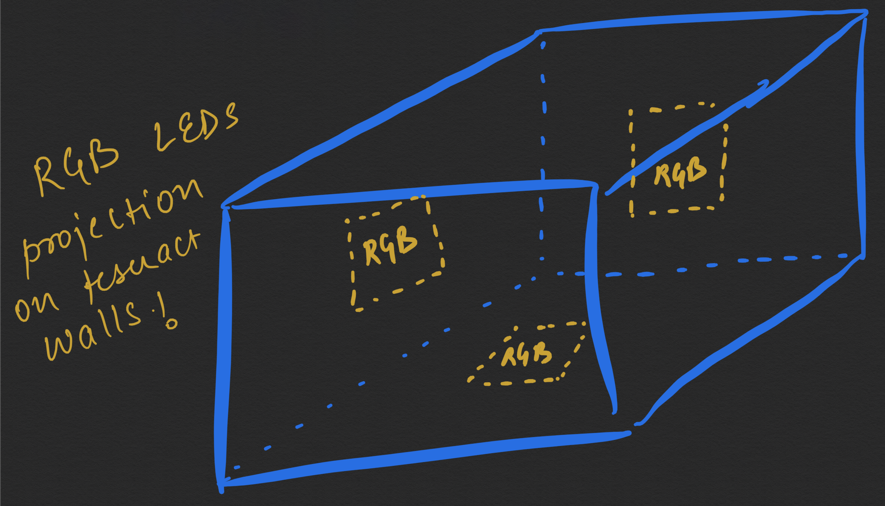
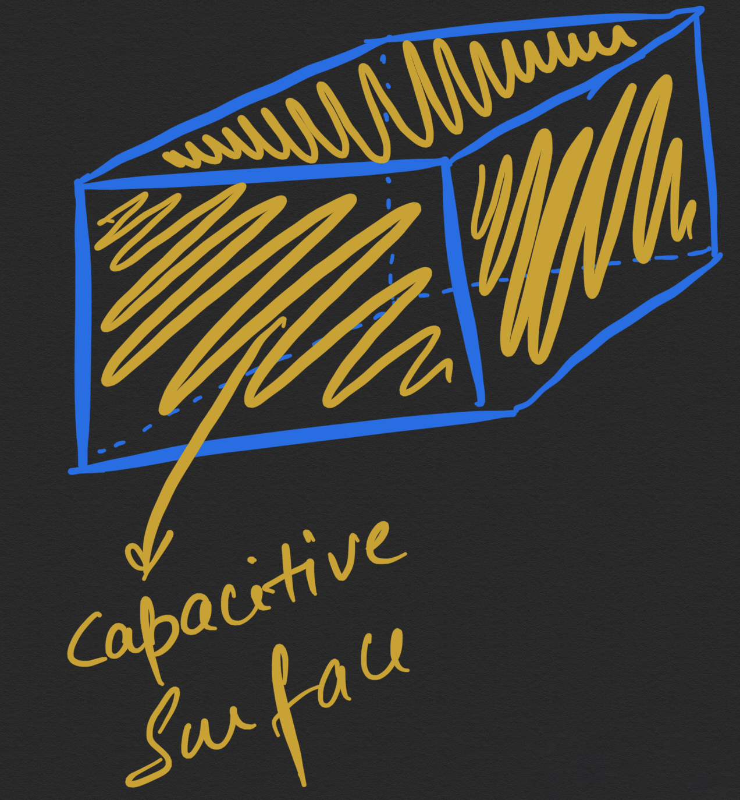

# Week 06 Journal

### Conceptual Description

I would like to explore how colors and emotions are related. Not only this but also how dynamic colors and static colors impact change in our emotions. Also, how feedbacks play an important role in expression of dynamics. In art therapy, color is often associated with a person’s emotions. Color may also influence a person’s mental or physical state. For example, studies have shown that some people looking at the color red resulted in an increased heart rate, which then led to additional adrenaline being pumped into the blood stream.

There are also commonly noted psychological effects of color as it relates to two main categories: warm and cool. Warm colors – such as red, yellow and orange – can spark a variety of emotions ranging from comfort and warmth to hostility and anger. Cool colors – such as green, blue and purple – often spark feelings of calmness as well as sadness. I want to explore this relationship through an interactive model.

### Narrative Description

I want to use a 4D diagonal sliced Tesseract for this interactive model with the internal cubical structure unsliced. Projecting colors onto visible faces of the tesseract would allow me in exploring the relationship of colors and emotions since a tesseract is a unique shape and is not understood by everyone. It would be unique to explore this relationship in this form.

The above figure illustrates a general tesseract while the following figure shows how slicing it diagonally would make it look like following illustration

### Technical Description

The tesseract will be changing color using RGB LEDs mounted on three inside faces of the inner cube which will give tesseract the desired color. Since RGB LEDs are used it will enable cube to have 25 million color combinations on each face. Apart from this the outer part of cube will be covered with copper tape to embed touch sensing capabilities to the cube.

The above figure shows how RGB LEDs will be placed inside inner cube of the tesseract. While the below figure illustrates copper tape warped around outer surface of the cube enabling touch sensing on the cube.

### Potential Problem
I think a potential problem I might face would be fabricating a perfect tesseract shape and assembling it as one. 