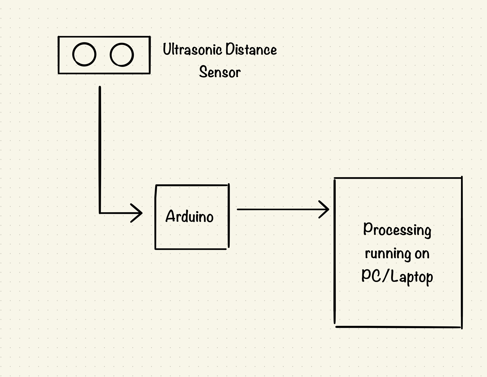
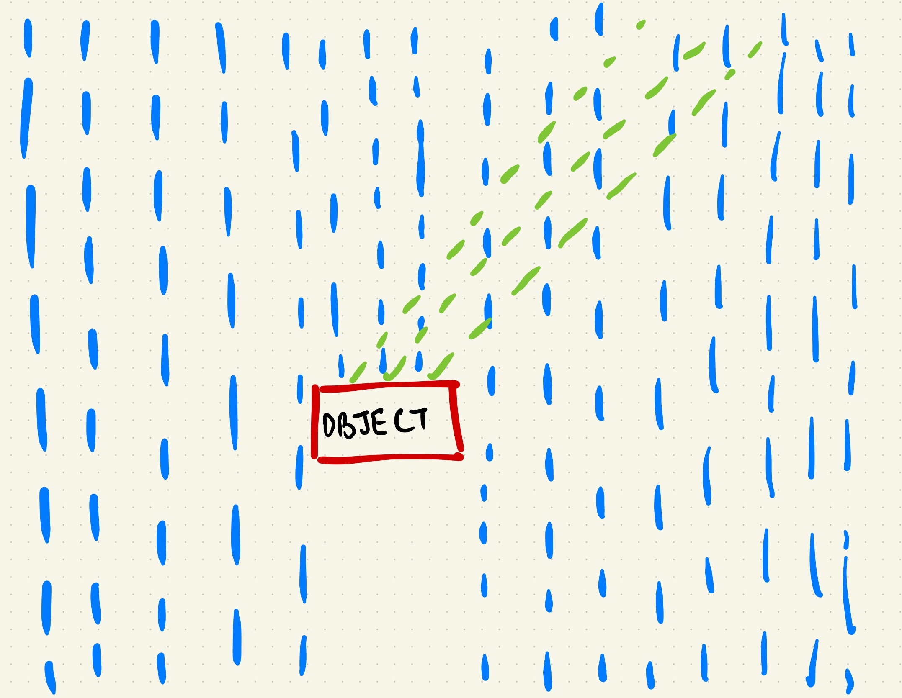

## Designing Interaction

For this week’s visualization project, I would explore in visualizing particle systems in processing and having an interaction based on physical sensors. So far, I’ve planned to do falling particles from top of the screen to the bottom of the screen while being interrupted by the sensor data; I’m planning to use an ultrasonic distance sensor and play around a visualization involving distance.

#### Block Diagram for the Process

My idea is to create a falling particle system, raining effect, in this case, another movable object is placed on the screen, and the rain effect rebounds in the area which is occupied by the object.

#### Intended Visualization
